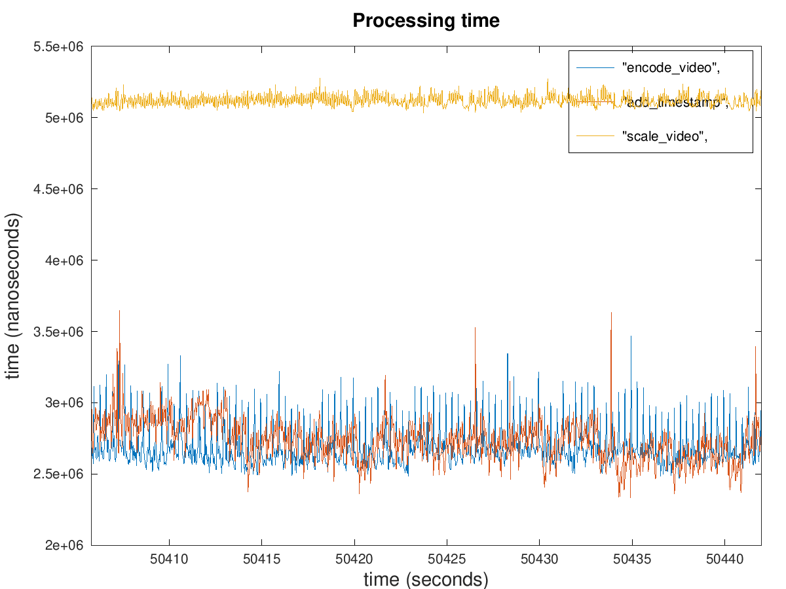

RTMP stream publisher
=================
### Feature

1. Hardware acceleration, support Intel HD graphics/Nvidia Jetson series
2. RTSP/v4l2/custom FPGA pull, rtmp push
3. much higher performance v4l2 element

### Performance

| hardware platform | input | output | cpu usage | process latency |
| --- | --- | --- | --- | -- |
| Jetson Xavier NX | v4l2,1280*720,YUYV,30fps | rtmp,h264 high yuv420p,640*360,30fps,2Mbps |  10% |  |
| Intel J1900 | rtsp,h264 main yuv420p,1280*720,25fps |  rtmp,h264 high yuv420p,640*480,25fps,2Mbps | 17% | todo |

#### Latency explain

process: add timestamp -> change video resolution -> video encode

Jetson Xavier NX, add timestamp uses about **3ms**, video resolution change uses about **5ms** and video encode uses about **3ms**.

### Install

* Centos 8

setup epel repo and rpmfusion repo using [add_rpmfusion_cn_mirror.sh](util/add_rpmfusion_cn_mirror.sh)

```bash
wget -O /etc/yum.repos.d/ubox.repo https://ubox-repo.ucloud.cn/repos/rpm/rhel8/ubox.repo
dnf install ubox-publisher
```

* Ubuntu 18.04 Bionic and Ubuntu 20.04 Focal

```bash
apt-key adv --fetch-keys http://ubox-deb.ucloud.cn/DEB-GPG-KEY-ubox
echo 'deb http://ubox-deb.ucloud.cn/repos/deb/all focal ubox' >> /etc/apt/sources.list
apt-get update
apt install ubox-publisher
```

### Test && Usage

1. run server,

```bash
ubox-publisher -u @/tmp/publisher.sock
```

2. test

```bash
# adjust json file
./build/test/cli @/tmp/publisher.sock < ./test/request/PushStream.json
```

### Self compiling

1. Dependency: RPMFusion and EPEL repositoires

* CentOS 8

setup epel repo and rpmfusion repo using [add_rpmfusion_cn_mirror.sh](util/add_rpmfusion_cn_mirror.sh)

```bash
dnf install glib2 pango-devel cairo-devel gstreamer1-devel gstreamer1-plugins-base-devel \ 
    gstreamer1 gstreamer1-libav gstreamer1-vaapi gstreamer1-plugins-base gstreamer1-plugins-bad-free \
    gstreamer1-plugins-good gstreamer1-plugins-ugly gstreamer1-plugins-ugly-free \
    libva-intel-driver gstreamer1-plugins-bad-freeworld
```

* Ubuntu 18.04/20.04

```bash
apt-get install libpango1.0-dev libgstreamer1.0-dev libgstreamer1.0-0 libgstreamer-plugins-bad1.0-0 libgstreamer-plugins-base1.0-0 \
    libgstreamer-plugins-base1.0-dev libgstreamer-plugins-good1.0-0 \
        gstreamer1.0-plugins-ugly gstreamer1.0-plugins-good gstreamer1.0-plugins-base \
        gstreamer1.0-plugins-bad gstreamer1.0-tools gstreamer1.0-rtsp gstreamer1.0-vaapi  gstreamer1.0-libav
```

2. compile

```bash
mkdir build
cd build
cmake ..
make install
```
